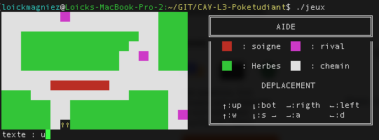
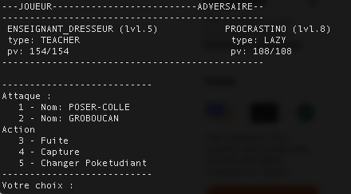
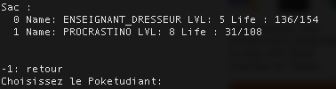
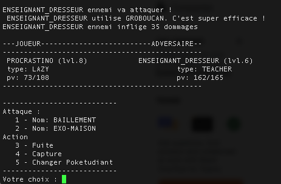

# Poketudiant (C language)

**Try it**: `./jeux`

Project developed during my third year at the university using C language.
We were asked to develop a Pokemon like game following a detailed specification document.

The game is played by using command line like the first computer games. (The GUI is drawn using ASCII character)

## Screenshots

